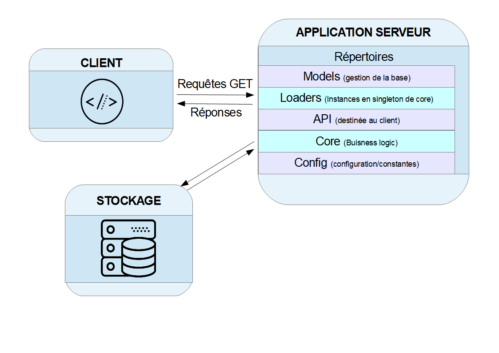
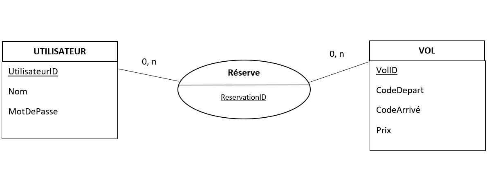

# E1-DESIGN
Objectif: réaliser une solution, ultra simplifié de reservation de billet d'avion

## Archictecture :
<!--  -->
Nous avons choisi une architecture client/serveur pour la réalisation de cette API. Le client et le serveur utilisent le même protocole de communication (HTTP).

## Modele de donnée relationnelle stocké :

## Stack technique :
Afin de développer l'API, nousa avons décidé d'utiliser l'environement Node.js.
Node.js est une plateforme logicielle libre en JavaScript orientée vers les applications réseau événementielles hautement concurrentes qui doivent pouvoir monter en charge. 

##### Front End:
* html: utilisé afin de créer et de représenter le contenu d'une page web et sa structure
* css: langage permettant de mettre en forme des pages web HTML
* js: langage de script utilisé pour développer des fonctionnalités interactives

##### Back End:
* Node. js:
  * Express.js: Express est une bibliothèque permettant de mettre en place une infrastructure d'applications Web Node.js
  minimaliste et flexible. Elle fournit un ensemble de fonctionnalités robuste pour les applications Web.
  * SQLite3: bibliothèque permettant de créer et de gérer une base de donnée avec js 
